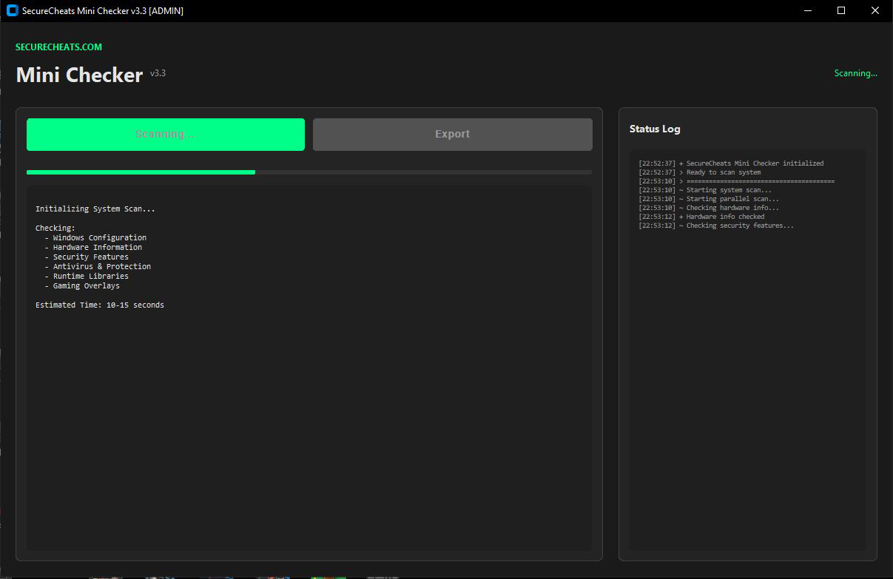

# SecureCheats System Checker

A free, lightweight Windows diagnostic tool that generates comprehensive system reports for tech support and troubleshooting.



## Features

- **One-click scanning** — Full system report in under 20 seconds
- **Exportable reports** — Copy or save results instantly
- **No installation required** — Portable executable
- **Gaming-focused** — Checks overlays, DirectX, C++ runtimes
- **Privacy-friendly** — No internet connection, no data collection

## What It Checks

| Category | Details |
|----------|---------|
| **Operating System** | Windows version, build number, activation status |
| **Hardware** | Motherboard, BIOS/UEFI version and mode, CPU, GPU, RAM |
| **GPU Drivers** | Driver version and date |
| **Security** | Secure Boot, TPM, BitLocker, Virtualization, Hypervisor |
| **Antivirus** | Windows Defender status, third-party AV detection |
| **Runtimes** | DirectX 9/10/11/12, Visual C++ 2005-2022 |
| **Gaming Overlays** | Discord, Steam, NVIDIA, Xbox Game Bar, OBS, MSI Afterburner |

## Sample Report

```
===========================================================================
                  SECURECHEATS SYSTEM CHECKER REPORT
===========================================================================
[ OPERATING SYSTEM ]
  Version ............. Microsoft Windows 11
  Feature Update ...... 23H2
  Build ............... 22631.2715

[ HARDWARE ]
  Motherboard ......... ASUSTeK PRIME H310-PLUS
  BIOS Version ........ 0401
  BIOS Mode ........... UEFI
  RAM ................. 16 GB

[ GRAPHICS ]
  GPU 1 ............... NVIDIA GeForce RTX 3070
    Driver Version .... 32.0.15.6094
    Driver Date ....... 08/13/2024

[ SECURITY ]
  [+] Secure Boot ...... On
  [+] TPM .............. 2.0
  [-] BitLocker ........ Not Enabled
  [+] Virtualization ... Enabled

[ C++ REDISTRIBUTABLES ]
  [+] Visual C++ 2015-2022
  [+] Visual C++ 2013
  [+] Visual C++ 2012
  [+] Visual C++ 2010

[ DIRECTX ]
  [+] DirectX 12 ....... Installed
  [+] DirectX 11 ....... Installed

[ GAMING OVERLAYS ]
  [+] Discord .......... Installed
  [-] Xbox Game Bar .... Disabled
  [+] Steam Overlay .... Enabled
===========================================================================
```

## Download

**[Download Latest Release](https://github.com/SecureCheats/system-checker/releases/latest)**

Or visit our website: [securecheats.com/system-checker](https://securecheats.com/system-checker/)

## Usage

1. Download `SecureCheats_System_Checker.exe` from [Releases](https://github.com/SecureCheats/system-checker/releases)
2. Run as Administrator (right-click → Run as administrator)
3. Click **Scan System**
4. Click **Export** or **Copy** to save/share your report

## Use Cases

- **Tech Support** — Share your full system specs instantly
- **Game Troubleshooting** — Check for missing runtimes or driver issues
- **Compatibility Checks** — Verify DirectX, C++ redistributables
- **Security Audits** — Review Secure Boot, TPM, virtualization settings

## Antivirus False Positives

This tool is built with PyInstaller, which some antivirus programs flag as suspicious due to its use by both legitimate developers and malware authors. This is a known industry-wide issue affecting thousands of safe applications.

**Verified clean by major vendors:**
- ✅ Windows Defender
- ✅ Avast / AVG
- ✅ BitDefender
- ✅ Kaspersky
- ✅ Norton
- ✅ Malwarebytes
- ✅ ESET
- ✅ CrowdStrike
- ✅ Sophos

If your antivirus flags the file:
1. Check the [VirusTotal scan](https://www.virustotal.com) (link in release notes)
2. Add an exception for the file
3. See our [Installation Guide](INSTALLATION.md) for detailed steps

## What This Tool Does NOT Do

- ❌ Modify system files
- ❌ Connect to the internet
- ❌ Install anything
- ❌ Collect personal data
- ❌ Run in the background

The tool only **reads** system information and displays it to you.

## System Requirements

- Windows 10 or Windows 11
- Run as Administrator for full functionality

## Source Code

Want to verify the code or run it directly with Python? See [SOURCE.md](SOURCE.md) for instructions.

## Support

- Website: [securecheats.com](https://securecheats.com)
- Tool Page: [securecheats.com/system-checker](https://securecheats.com/system-checker/)

## License

Freeware — Free for personal use.

---

Made by [SecureCheats](https://securecheats.com)
